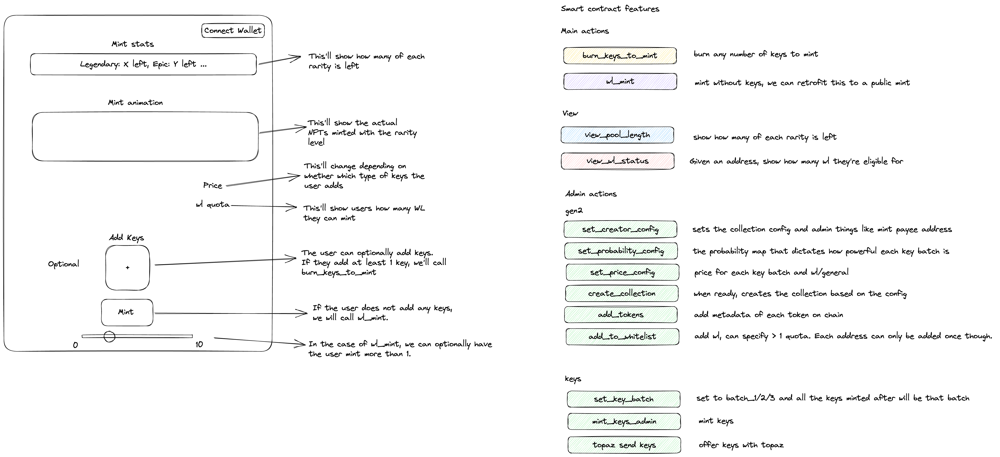

# keys_mint

## A visual of the overall flow


## Pre-requisite
Make sure that nodejs is installed. Follow instructions here: https://docs.npmjs.com/downloading-and-installing-node-js-and-npm#using-a-node-installer-to-install-nodejs-and-npm

I also recommend a text editor like sublime (https://www.sublimetext.com/3) because it will make your life easier. 

## How to use all this
1. Download this package and unzip to Desktop or somewhere else easy to find
2. Open terminal (google if you aren't sure)
(The rest of instructions are all in terminal).
3. Go into the folder containing the unzipped file
   1. `cd <path>` (google if you aren't sure how to do it, e.g. https://www.onmsft.com/how-to/change-directories-command-prompt-windows-10-11)
4. Run `npm install`
5. You'll need to modify .env file with the account & private key
6. You'll need to modify all the script files (find them in the script folder)
   1. Read the next section to see what each of them do. You'll likely need to call them in that order. 
7. Call script with `node scripts/<script_name>.js > <script_name>_log.txt`, e.g. `node scripts/a2_mint_keys.js > a2_mint_keys_log.txt`

## Scripts
### Gen2
I'll likely do all the initial set up anyways, the only function realistically that'll be called repeatedly is 
* [c2_add_to_wl](scripts/c2_add_to_wl.js): We'll likely figure out some CSV way of doing this, but basically the input is a list of addresses and there is an amount variable that can be used to specify the quota. Note that if the address has already been added, this will fail.
  * [d2_see_wl](scripts/d2_see_wl.js): This script will tell you whether an address has been already added to the list. If it's 0, it's likely not in the list (there's still a small chance that they just used up all the allocation, but we don't have to worry about this anytime soon).

Let's go through the other ones just in case
* [b1a_set_creator_config](scripts/b1a_set_creator_config.js): This sets up the collection details as well as the token description. This does mean that all the tokens will have the same description.
* [b1b_set_probability_config](scripts/b1b_set_probability_config.js): This sets the probabilites for each batch. All the columns and rows have to add up to 100 or it will fail!
* [b1c_set_price_config](scripts/b1c_set_price_config.js): This sets the price for each batch (remember that wl is general batch).
* [b1d_create_gen2_collection](scripts/b1d_create_gen2_collection.js): This creates the collection. No input is needed. 
* [c1_add_to_pool](scripts/c1_add_to_pool.js): We'll need a CSV way of doing this for sure. This is all the token metadatas that'll be stored on chain which includes all the **traits** and the **rarity**, and **token name** and **token uri**. 
  * [d1_see_number_tokens_left](scripts/d1_see_number_tokens_left.js): This'll help us make sure that we added all the token metadata correctly. 

### Keys
The move code is already deployed on mainnet. I added JS scripts to call the major functions. Each of the scripts will need to be modified with the correct configuration. Let's go through each of them.

* [a2a_set_key_batch](scripts/a2a_set_key_batch.js): Specifies which batch to mint next. Takes in `batch_1`, `batch_2`, and `batch_3`. Once a batch is set subsequent mints will be that batch.

* [a2b_mint_keys](scripts/a2b_mint_keys.js): mints all the keys in the collection in batches of 100. You should definitely put a small number to test how much gas it will cost. Gas cost should be linear. You'll need to mint 1 for each address so the amount should be the same as number of addresses. 

* [a3_send_keys](scripts/a3_send_keys.js): You'll provide the list of addresses and we'll call topaz send on them. I also ask for the start key number so that we know which key to start sending first (e.g. if you're sending to 5 people and start key number is 0, then we'll send Key #0 to Key #4 to these 5 people). IMPORTANT: If you ever need to restart (after testing or if the program crashes), you'll need to reset the start number (logs will show latest sent so add 1 to that), as well as removing already processed addresses (they're processed in order and the logs will provide addresses that were processed)

We already did this one so no need to worry
* a1_create_keys_collection.js: creates the key collection. You'll need to provide all the necessary fields. I also ask about the token such as the `base_token_name`. It will be used to generate Key #123 (where `Key` is the `base_token_name`)

... Will fill the rest later. 

## Code deployment flow
This code is deployed to a resource account so the deployment flow isn't the typical standard deployment. 
* For context, the package was initially deployed via
  * ```aptos move create-resource-account-and-publish-package  --seed 1 --package-dir ./move --address-name keys_custom --named-addresses source_addr=blah --profile BLAH```

The overall flow is 2 parts: first compile package, then take the compiled package and deploy using a move script. 
* Compile, 
  * In the `move` folder, run `aptos move compile --save-metadata`
  * Get the binaries
    * Metadata: `cat build/keys/package-metadata.bcs | xxd -ps | tr '\n' '\0'`
    * big_vector: `cat build/keys/bytecode_modules/big_vector.mv | xxd -ps | tr '\n' '\0'`
    * bucket_table: `cat build/keys/bytecode_modules/bucket_table.mv | xxd -ps | tr '\n' '\0'`
    * minting: `cat build/keys/bytecode_modules/minting.mv | xxd -ps | tr '\n' '\0'`
* In the `deploy_code` folder
  * In the `sources/run_script.move` file, replace the existing binaries with results from previous section. (e.g. swap what's inside of `minting = x""` with results above). 
  * Run `aptos move compile && aptos move run-script --compiled-script-path build/run_script/bytecode_scripts/main.mv --profile bla`